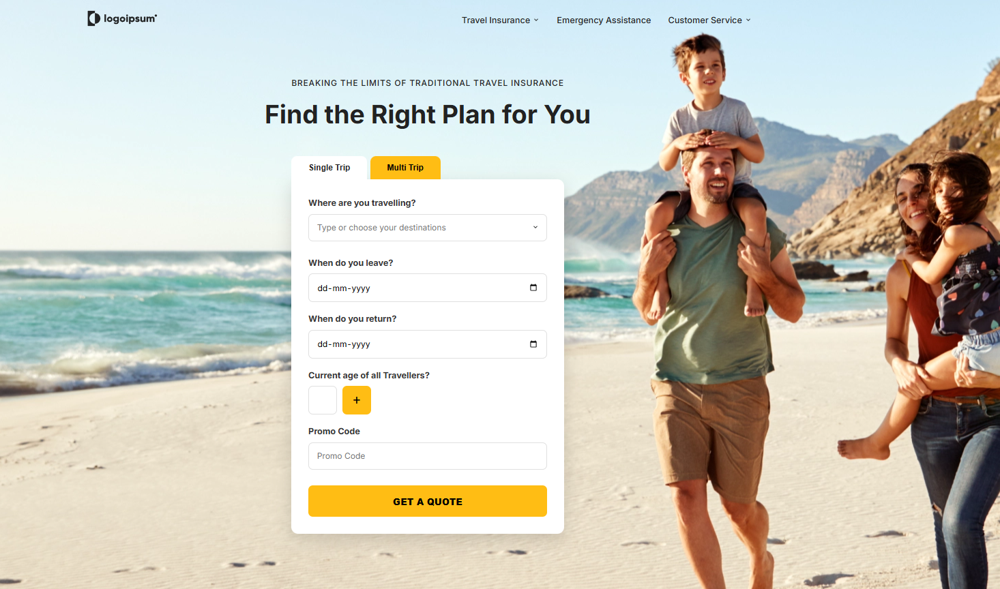
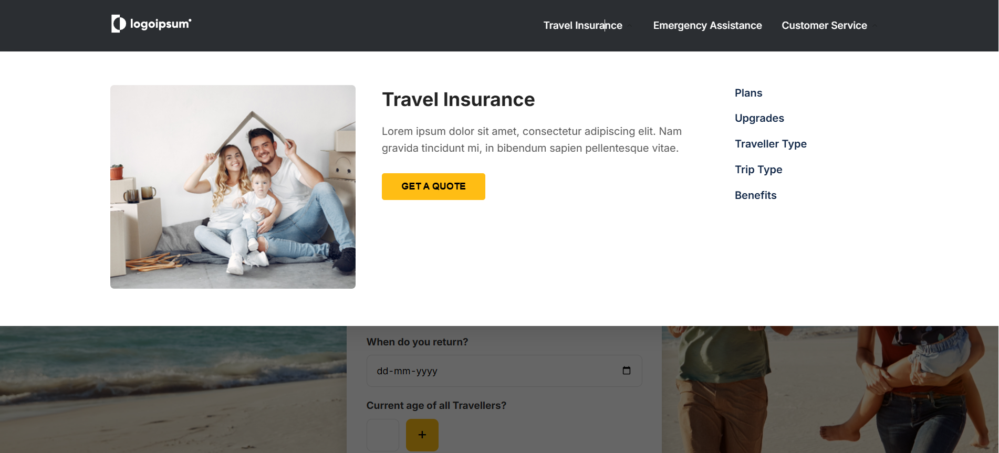
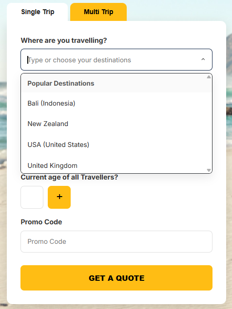
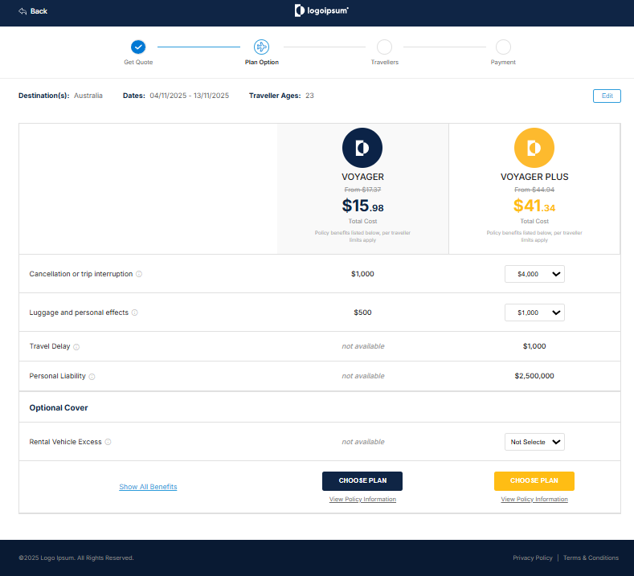
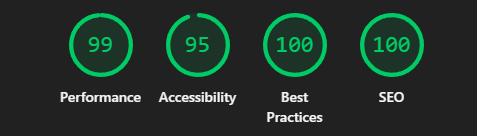
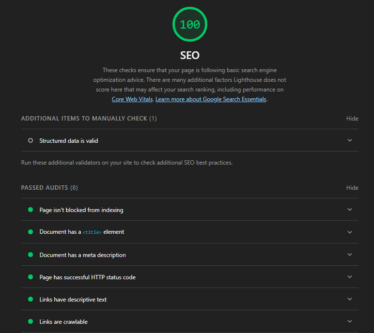

# Travel Insurance Website

A fully responsive and accessible **Travel Insurance and plan selection web application**, designed with a strong focus on **user experience, performance, SEO, and accessibility**.

This project simulates a real-world insurance journey — from selecting destinations and travel details to comparing insurance plans — similar to modern production-grade insurance platforms.

---

# Screenshots

## Home Page:


## Navigation menus:


## Destination Dropdown & Chip Selection:


## Choose Plan Page:


## SEO:

## Performance & Accessibility:


---

## Tech Stack 🛠️

### Frontend Technologies
- HTML5 (Semantic & SEO-friendly)
- CSS3 (Responsive, Custom Design System)
- Vanilla JavaScript (No frameworks)

### Assets & Fonts
- Google Fonts (Inter)
- Optimized SVG & WebP images

---

## Project Structure 📂

```
Travel Insurance/
│
├── index.html
├── style.css
├── app.js
├── assets/
│
├── choose-plan/
│ ├── index.html
│ ├── style.css
│ └── app.js
│
└── screenshots/
```


---

## Key Features 🚀

### Destination Selection with Smart Dropdown
Users can search and select destinations using a custom-built dropdown component.

### Single Trip & Multi Trip Support
- **Single Trip** allows only one destination.
- **Multi Trip** allows multiple destinations.

### Destination Chip Management
- Selected destinations are displayed as removable chips.
- Each destination can be selected **only once**.

### Dynamic Traveller Age Input
- Add multiple traveller ages dynamically.
- Accessible input fields with proper ARIA labels.

### Responsive Navigation
- Desktop Mega Menu
- Mobile Slide-in Hamburger Menu

---

## Destination Dropdown Rules

### Users can select each destination only once
If a destination (e.g. *Bali*) is selected multiple times, only a **single chip** is added.

### Remove destination using close button
Clicking the close (×) button on a chip removes that destination from the selected list.

### Empty state handling
If the destination search returns no results, an empty state message is displayed:
> **"Destination not found"**

### Keyboard Accessible Dropdown
The dropdown is fully keyboard accessible:
- **Arrow Down / Arrow Up** → Navigate options
- **Enter** → Select destination
- **Escape** → Close dropdown

---

## Accessibility

Accessibility was a major focus while building this project.

### Implemented Accessibility Features
- Proper `<label>` association with inputs
- Keyboard navigation support across dropdowns and forms
- ARIA attributes like `aria-label`
- Visual focus indication for keyboard navigation
- Screen-reader friendly structure

---

## SEO Optimization 🚀

This project achieves **excellent SEO and Lighthouse scores**, making it production-ready.

### Lighthouse Audit Scores
- **Performance:** 99
- **Accessibility:** 95
- **Best Practices:** 100
- **SEO:** 100

### SEO Techniques Used
- Semantic HTML (`header`, `nav`, `main`, `section`, `footer`)
- Optimized meta description and page titles
- Mobile-friendly viewport configuration
- Optimized images (SVG & WebP)
- `Preloaded` Google Fonts for faster rendering
- Clean and structured folder hierarchy

---

## Responsive Design 📱💻

### Desktop Experience
- Mega menu navigation
- Side-by-side plan comparison table
- Hover-based interactions

### Mobile Experience
- Hamburger navigation menu
- Tab-based insurance plan switching
- Touch-friendly UI elements

---

## Insurance Plan Comparison 🧾

### Desktop View
- Full comparison between **Voyager** and **Voyager Plus**
- Clear pricing, benefits, and optional covers

### Mobile View
- Simplified UI with plan tabs
- Improved readability on small screens

---

## Code Quality & Best Practices 🧠

### JavaScript
- Clean logic
- No external dependencies
- Efficient event handling

### CSS
- CSS variables for designing
- Mobile-first responsive approach
- Reusable and scalable styles

### Performance
- Optimized asset loading

---

## Why This Project Stands Out

- Real-world insurance workflow simulation
- Strong focus on accessibility and SEO
- Framework-free implementation showing core frontend skills

---

## Future Enhancements 🔮

### Planned Improvements
- Backend & API integration
- Advanced form validation

---

## Author 👨‍💻

**SuvroDip Chakroborty**  
B.Tech in Computer Science & Engineering  
Frontend & Full-Stack Developer  

Focused on building **accessible, scalable web applications**.

---

